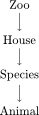
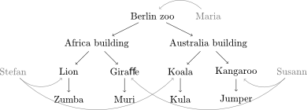
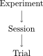
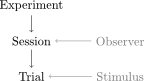

The data model
==============

Conceptual idea for using xdapy:

1) save a whole scene not only single events
2) separate scene in hierarchical relations 
3) supplement other informations to be attached to that hierarchy.
4) turn into xdapy structures. 

Zoo example
-----------
To illustrate the idea with an example from outside experimental science, think of a zoo. 
This zoo has animals from two continents, Africa and Australia, and four species. 
For each continent a specific house was build. The African building contains lions and giraffes. 
The Australian house koala bears and kangaroos. Maria, the zoo manager employs two zookeepers, Susann and Stefan. 
To keep track of the animal a zoo database is created. 
Susann and Stefan can use the database for example to estimate the amount of food they need to order or 
to keep track of the animals' health records. 

1)
To save all the information about the zoo, we first determine the properties of the zoo, for example its opening hours, its animals and . 
These properties cluster into logical groups which we isolate and label with a name. 
Here, the clusters could be called: zoo for very general informations,
buildings for the two animal houses, species for a species' general properties, animal for the distinct properties of one specific animal and person for the information about the people working at the zoo.
This is a possible list of clusters for the zoo example with their label and properties.
 
zoo
...       
=============  	============
opening hours	city
=============  	============
9.00h-18.00h 	Berlin
=============  	============

house		
.....
===========  ===========  ====
continent    temperature  area
===========  ===========  ====
Africa       28 degree C  2 ha
Australia    25 degree C  1 ha
===========  ===========  ====

species	
.......
============  ==========  ===========  ============
type          diet        foot demand  water demand
============  ==========  ===========  ============
Lion          carnivore   4 kg         1 l
Giraffe       vegetarian  2 kg         3 l 
Kangaroos     vegetarian  1 kg         0.8 l
Koala bear    vegetarian  0.5 kg       0.5 l
============  ==========  ===========  ============

animal		
......
=============  	=============   ==============  =============  	=============
name            weight          birthday        birthplace      gender
=============  	=============   ==============  =============  	=============
Zumba           1000 kg         12.03.1995      Serengeti       male
Kula            50 kg           06.07.2008      Ayers Rock      female
Muri            200 kg          01.03.2012      Berlin          female
Jumper          180 kg          25.12.2003      London          male
=============  	=============   ==============  =============  	=============

person
......
=============  	=============   ============== 	==============
name            job             birthyear       gender
=============  	=============   ============== 	==============
Susann          zookeeper       1983            female
Stefan          zookeeper       1976            male
Maria           manager         1973            female
=============  	=============   ============== 	==============

2)
Next we determine a hierarchical order of the clusters.

3)
The hierarchy is missing the persons that work at the zoo.
Stefan is responsible for the lions and koala bears and Susann for giraffes and kangaroos.
The zookeepers can not simply be incorporated into the hierarchy. 
Wherever we were to put them in the hierarchy, they would occur repeatedly.
That is why we attach them to the hierarchy at the level they would occur. 
As our zookeepers are responsible for several species, the manager is responsible for the whole zoo. 
 
 .. figure:: images/fullhierZoo.png
 
 
The tree of objects that follows from above hierarchy looks like this:

 
4) 
After having isolated the critical clusters and properties, we would have to turn them into structures that Xdapy understands. 
How this is done is explained in the section on Xdapy's :ref:`usage`. 
There we will be more concrete and provide Python code and technical remarks. 
The code examples do not use the zoo data model, but a very simplified data model for experimental data. 
The following example explains the logic of the experimental data model. 

.. _example2:

Science example
---------------

How can all the data about an experiment including
annotations be structured? To approach this
question we will inspect a typical visual psychophysics experiment. 
An observer sits in front of the monitor
and holds a response box in her hands. A stimulus is presented 
on the screen and depending on the task, the observer
presses a button. A computer controls stimulus presentation
as well as response registration. This scene is part of a larger
context. The observer participates in a full experiment which
probably requires that the person observes several sessions
likely at different days. During a session the observer sees
many stimuli and a single repetition of stimulus presentation
with response is called a trial. For its subsequent analysis, all
information present in the scene should be stored as annotations
in addition to the data. Temporal, material, or logical
units—such as the observer, the equipment, the experimental
design, a specific session, or a single trial—implicitly divide
annotations and data into clusters. The objects emerge out
of these clusters. Moreover, most experiments have an inherent,
hierarchical structure. A trial, for example, belongs to a
session within an experiment. 

At some point, we may want to add annotations related to, say, the observer of a certain experiment. 
Maybe his or her age and some other attributes. An observer might participate in several experiments and most likely 
several observers participate in an experiment. If we want to keep the structure unambiguous, we can not simply insert 
an observer object into the hierarchy. It needs to stay outside the experimental hierarchy and is simply attached to 
an object in the hierarchy. The same strategy is used for the stimuli.

The most general annotations that could be added at the highest level with the experiment could embrace:

Experiment
..........
========  =======  ===========  ==========
project   author   date         identifier
========  =======  ===========  ==========
visual    John Jo  12.12.2012   5005
auditory  Max Yes  04.05.2010   1001
========  =======  ===========  ==========

The next section explains:

* how the objects in the hierarchy are represented as Xdapy structures.

* how the two different types of connections - in the hierarchy or the attachments - are created. 

* how objects are stored or loaded.

* how a search in the database is performed. 

